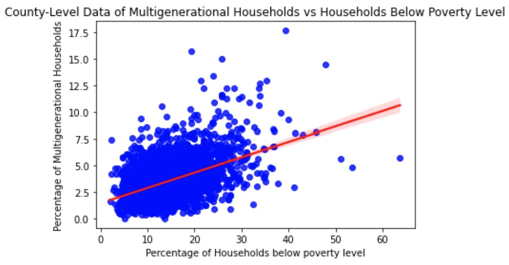

# Analyzing 2022 COVID Data with relation to Multigenerational Household and Poverty Data
The goal of this project is to analyze the cumulative number of deaths in US counties with relation to the number of multigenerational households. I will also be looking into the percentage of households below the poverty line with relation to these two factors as well. Multigenerational families were chosen because there tends to be more older people in these families and age makes people more susceptible to infection. Multigenerational families also tend to be less susceptible to poverty so it will be interesting to see how the cumulative death counts compare.

Link to statistics on multigenerational households: https://www.pewresearch.org/social-trends/2022/03/24/the-demographics-of-multigenerational-households/#:~:text=In%20March%202021%2C%20there%20were,households%20in%202021%20was%2018%25

Above is a visualization of the multigenerational household data with the poverty data. The line of best fit is also found on the plot, depicting the correlation between cumulative COVID death, multigenerational households, and households under the poverty line. There is a strong correlation between being in a multigenerational household and a higher number of COVID deaths in a given county. Code to reproduce the plot shown above can be found <a href="Analyzing COVID Data_Project 1.ipynb">here</a>
